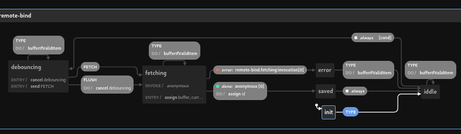

# svelte-remote-bind

```bash
npm i svelte-remote-bind
```

or

```bash
yarn add svelte-remote-bind
```

(this is a svelte-kit project, so to see the demo working: yarn && yarn dev)

[Demo](https://svelte-remote-bind.surge.sh)

The aim of this project is to bind a form to a remote endpoint so a POST or PUT is done automatically while typing. There's a state machine with states: idle, debouncing, fetching, error and saved.

Would you like to write some code like this?

```svelte
<RemoteForm remoteBind="endpoint:cat" bind:item={cat} let:state let:verrors>
    Name: <input type="text" bind:value={cat.name} />
    Age: <input type="number" bind:value={cat.age} />
</RemoteForm>
```

or

```svelte
let cat = {name: 'fuffy', age: 1 } 

const {state, flush, errors, update: updateMyCat} = useRemoteBind({id: 3, bind: 'endpoint:cat'})

$: updateMyCat(cat)

<div>
    Name: <input type="text" bind:value={cat.name} />
    Age: <input type="number" bind:value={cat.age} />
    {#if $state.value === 'debouncing'}
        <button on:click={flush}>Save!</button>
    {/if}
</div>
```


Full example:

```svelte
<script lang="ts">
    import { setContext } from 'svelte';
    import { RemoteForm} from 'svelte-remote-bind';
    import { create, test, enforce } from 'vest';

    const suite = create((data = {}) => {
        test('name', 'Name is required', () => {
            enforce(data.name).isNotBlank();
        });

        test('age', 'Age is required', () => {
            enforce(data.age).isNotBlank();
        });

        test('age', 'Age is a number', () => {
            enforce(data.age).isNumeric();
        });

    });

    let endpoint = {
        //default to fetch
        fetch: async ({id, url, headers, method, body, entitySchema}) => {
            //entitySchema is useful when doing a GraphQL query 
            //example:
            const query = method === 'POST' ? entitySchema.addQuery : entitySchema.updateQuery;
            const variables = // create with id and body
            const response = await GraphQLClient.fetch({url, query, headers, variables});
            return entitySchema.key(response)
        },
        debounceTime: 1000, //default to 1000
        token: async () => "Bearer ABC", //default to null
        name: "endpoint",
        baseUrl: "https://my-backend/api",
        entities: {
            cat: {
                path: "/cat", //default to ""
                addQuery: ...,
                updateQuery: ...,
                validation: (data) => suite(data).isValid(), //default to () => true
                errors: (data) => suite(data), //default to () => ({})
                key: (data) => data.cat.id //default to "id"
            }
        }
    }

    setContext("remoteBindEndpoints", {
        endpoint
    });

    let cat = {name: 'fuffy', age: 1 } 

</script>

<div>It's my cat ;)</div>

<RemoteForm remoteBind="endpoint:cat" bind:item={cat} let:state let:verrors let:flush>
    Name: <input class="input input-bordered w-full max-w-xs" type="text" bind:value={cat.name} />
    Age: <input class="input input-bordered w-full max-w-xs" type="number" bind:value={cat.age} />
    <div class={`${state}`}>State: {state}</div>
    <div>Errors: {JSON.stringify(verrors.tests)}</div>
</RemoteForm>
```

Implementation: The actual implementation is with xstate.



To run tests:

```bash
yarn test
```

### Contributors

